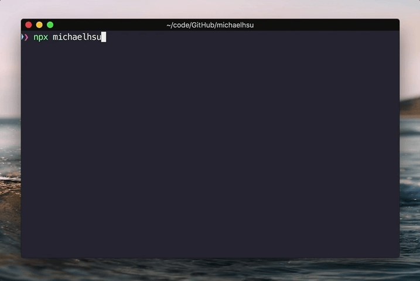

# michaelhsu

> The Michael Hsu CLI

[![Travis][build-badge]][build]
[![npm package][npm-badge]][npm]
[![npm downloads][npm-downloads]][npm]

[![Dependency Status][dependency-badge]][dependency]
[![devDependency Status][devdependency-badge]][devdependency]
[![peerDependency Status][peerdependency-badge]][peerdependency]

[![prettier][prettier-badge]][prettier]
[![license][license-badge]][license]

## Usage

```shell
$ npx michaelhsu
```

## Demo



## API

```sh
$ npx michaelhsu --help

The Michael Hsu CLI

Usage:
  $ npx michaelhsu

Options:
  -h, --help     Show help                                             [boolean]
  -v, --version  Show version number                                   [boolean]

For more information go to https://github.com/evenchange4/michaelhsu
```

## Development

### Requirements

* node >= 10.0.0
* yarn >= 1.6.0

```
$ yarn install --pure-lockfile
$ ./src/cli
```

## Test

```
$ yarn run format
$ yarn run eslint
$ yarn run flow
```

### NPM Release

> Any git tags.

1.  Create a new git tag
2.  Update `CHANGELOG.md`

```sh
$ npm version patch
$ npm run changelog
```

---

## Inspiration

* https://github.com/sindresorhus/sindresorhus

## CONTRIBUTING

* ⇄ Pull requests and ★ Stars are always welcome.
* For bugs and feature requests, please create an issue.
* Pull requests must be accompanied by passing automated tests (`$ yarn test`).

## [CHANGELOG](CHANGELOG.md)

## [LICENSE](LICENSE)

MIT: [http://michaelhsu.mit-license.org](http://michaelhsu.mit-license.org)

[build-badge]: https://travis-ci.com/evenchange4/michaelhsu.svg?branch=master
[build]: https://travis-ci.com/evenchange4/michaelhsu
[npm-badge]: https://img.shields.io/npm/v/michaelhsu.svg?style=flat-square
[npm]: https://www.npmjs.org/package/michaelhsu
[codecov-badge]: https://img.shields.io/codecov/c/github/evenchange4/michaelhsu.svg?style=flat-square
[codecov]: https://codecov.io/github/evenchange4/michaelhsu?branch=master
[npm-downloads]: https://img.shields.io/npm/dt/michaelhsu.svg?style=flat-square
[license-badge]: https://img.shields.io/npm/l/michaelhsu.svg?style=flat-square
[license]: http://michaelhsu.mit-license.org/
[dependency-badge]: https://david-dm.org/evenchange4/michaelhsu.svg?style=flat-square
[dependency]: https://david-dm.org/evenchange4/michaelhsu
[devdependency-badge]: https://david-dm.org/evenchange4/michaelhsu/dev-status.svg?style=flat-square
[devdependency]: https://david-dm.org/evenchange4/michaelhsu#info=devDependencies
[peerdependency-badge]: https://david-dm.org/evenchange4/michaelhsu/peer-status.svg?style=flat-square
[peerdependency]: https://david-dm.org/evenchange4/michaelhsu#info=peerDependencies
[prettier-badge]: https://img.shields.io/badge/styled_with-prettier-ff69b4.svg?style=flat-square
[prettier]: https://github.com/prettier/prettier
